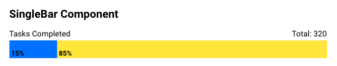
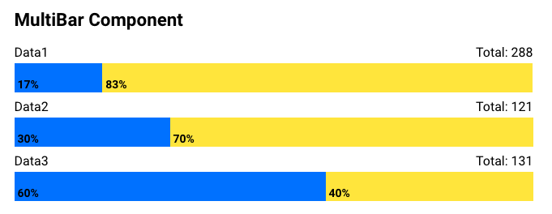
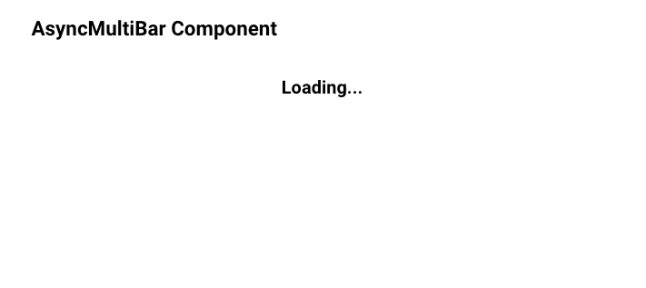
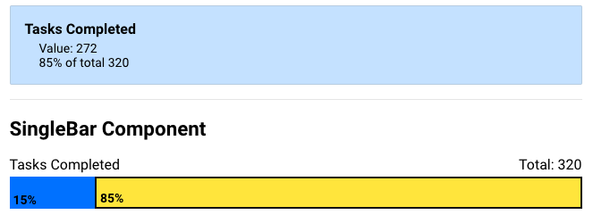

## Overview

This should hopefully be a fairly simple challenge, so **please do not spend too much time on it**. If you have any questions or need any clarification on anything, please don't hesitate to reach out!

### Guidelines

- Must be built in React. You can use any modern version, and use as many or as few React features you feel appropriate (e.g. hooks, context, etc.)
  - Boilerplates/starter kits _are_ permitted, so if you want to use `create-react-app`, for example, that is perfectly fine
- The app does not need to be fancy, or have multiple pages/routing, etc. Feel free to just do a single page showing all of the examples together.
- External JS libs are permitted as long as they do not complete the task for you (e.g. `axios` is acceptable, but `react-progressbar` is not)
  - **Bonus** for building with TypeScript, although it is not a requirement
- No CSS libs. The CSS requirements should be reasonably light here, so please build your CSS from scratch.
  - Bear in mind, this is not a design challenge, so as long as it fulfills the requirements, it does not have to be beautiful.
  - As far as tooling, you can use whatever you want (CSS, Sass, CSS Modules, styled-components, etc.). The most important thing is simply completing the requirements.
- Tests are definitely encouraged, but completing the tasks themselves is by far the most important thing.

Above all else, please remember not to spend _too much_ time on this. If using a certain technology or library is going to require twice as much time, it's probably not worth it. 👍

## Submitting

- Please use `Git` for version control on this project
- Provide us a link where we can clone the repo, along with instructions for getting started (even if it's as simple as running `yarn install` and `yarn start`)

---

## Tasks

### 1. SingleBar

- Create a `SingleBar` component that matches the interface shown in the example below
- The component should fill its parent width (no hard-coded width values)

```jsx
<SingleBar
  left={{ color: '#007cff', value: 48 }}
  right={{ color: '#ffe944', value: 272 }}
  title="Tasks Completed"
/>
```

The code above should render a component that looks roughly like:



---

### 2. MultiBar

- Use the `SingleBar` component from the previous example to display multiple datasets.
- The interface should be indentical, with the exception that it takes an array of datasets instead of a single one

```jsx
const values = [
  {
    title: 'Data1',
    left: { color: '#007cff', value: 48 },
    right: { color: '#ffe944', value: 240 },
  },
  {
    title: 'Data2',
    left: { color: '#007cff', value: 36 },
    right: { color: '#ffe944', value: 85 },
  },
  {
    title: 'Data3',
    left: { color: '#007cff', value: 79 },
    right: { color: '#ffe944', value: 52 },
  },
]

<MultiBar values={values} />
```

The code above should render a component that looks roughly like:



---

### 3. API Interaction

- Fetch the data from [this mock API](https://gist.githubusercontent.com/gargrave/e2fd3d07d44862a094dabb36137a9187/raw/29f8aef5813e1f67ab12f90617638091561b6b25/mock-api.json) and use it to populate a `MultiBar`.
- Should show some sort of "loading" indicator while the request is pending, even if it is simply showing the text `Loading...`
- Note that the API may not be formatting our data exactly how we need it, so you may need to tweak it a bit before passing it to the component.
  - (Use your best judgement on colors for the left/right values here)



---

### 4. User Interaction

- On mouse over, highlight the associated section of the graph
- Display the data related to that section in another area
  - (No strict styling requirements here; it just needs to be clean and readable)


